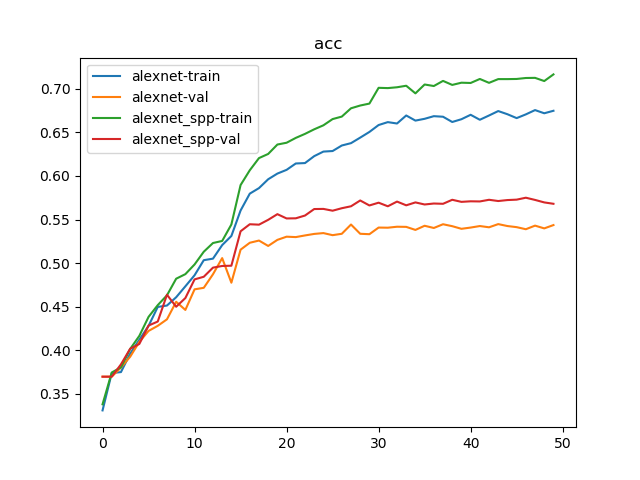
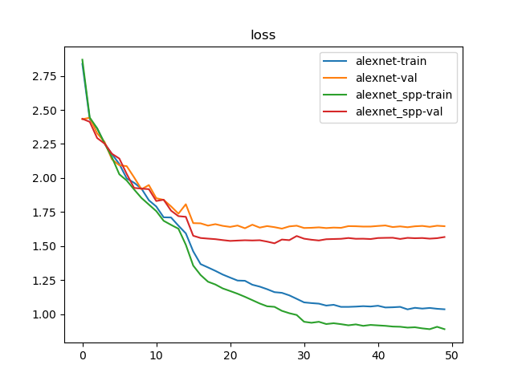

# 图像分类

相关分类结果及分析参考[空间金字塔池化层](https://blog.zhujian.life/posts/480bd989.html)

## Python文件

* 数据集创建：`py/utils/data/create_voc_train_val.py`
* 金字塔池化层定义：`py/models/spatial_pyramid_pooling.py`
* `AlexNet+SPP-net`定义：`py/models/alexnet_spp.py`
* 分类器实现：`py/classifier/classifier.py`

## 实现结果

